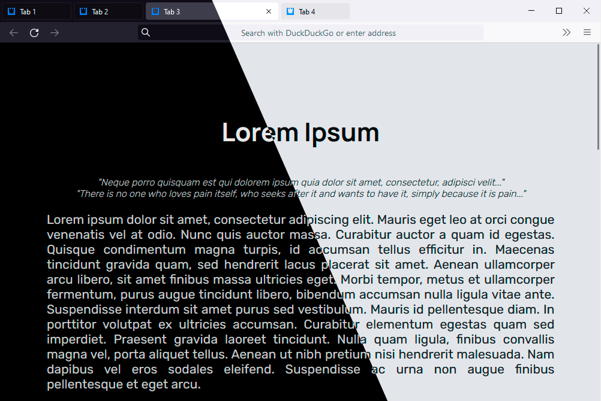

  

# Firefox Tweaks and Stuff
### For version 92+

*To enable floating scrollbars use userscript loaders, such as [MrOtherGuy/fx-autoconfig](https://github.com/MrOtherGuy/fx-autoconfig).*

## Installation

[Video](https://youtu.be/n3lCF9PZmUU)

Copy the contents of the `profile` folder to your Firefox profile folder.